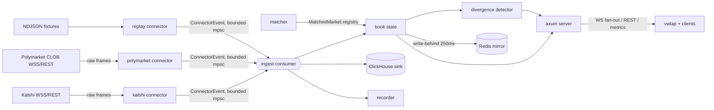

# Architecture

> Status: v1 complete (M0–M6) — all subsystems integrated in the `venuewire`
> daemon (connectors → state → divergence → server + sinks), full Prometheus
> metric set on `/metrics`, and reproducible benchmarks (`make bench`,
> [benchmarks.md](benchmarks.md)).

## Data flow (target v1)

1. Connectors hold venue WebSocket sessions (REST snapshot at startup, WSS for
   deltas), stamp `recv_ts` immediately after frame read, normalize into
   canonical `Tick`s, and push `ConnectorEvent`s into a bounded channel.
   Overflow is handled by per-instrument conflation, never drop-oldest.
2. The ingest pipeline fans events to the in-memory book state (hot path,
   lock-free reads, no await-holding locks), the ClickHouse batching sink, and
   the recorder.
3. The matcher runs off the hot path (startup + timer), maintaining the
   cross-venue `MatchedMarket` registry in `config/matches.yaml`.
4. On ticks touching matched markets, the divergence detector compares leg mids
   with freshness and debounce rules and emits `DivergenceEvent`s.
5. The axum server serves REST snapshots from in-memory state and fans out
   ticks/divergences over WS via `tokio::sync::broadcast`; slow clients get
   `lagged` frames instead of backpressuring ingest.

## What exists today (v1, M0–M6)

- `vw-core`: canonical types (`Tick`, `Instrument`, `MatchedMarket`,
  `DivergenceEvent`, `RawFrame`), normalization helpers, config model,
  tracing init.
- `vw-connectors`:
  - the `VenueConnector` trait and `ConnectorEvent` contract, plus shared
    reliability plumbing (`Backoff`, `Watchdog`, `ConflatingSender`);
  - **Kalshi connector**: REST discovery for `[kalshi].series_filters`
    (Instrument metadata + snapshot ticks), authenticated WSS ticker stream
    (RSA-PSS API-key signing, supervised reconnect with jittered backoff,
    staleness watchdog), and a degraded REST-polling mode when no credentials
    are configured (D6). One shared normalization path
    (`kalshi::normalize::normalize_frame`) serves live and replay;
  - **Polymarket connector**: tag-based Gamma REST discovery
    (`[polymarket].tags` slugs → tag ids, D8) and the unauthenticated CLOB
    WSS market channel subscribed by yes-leg token ids (D10), with the same
    supervised reconnect/backoff/staleness plumbing plus the venue's literal
    text `PING`/`PONG` keep-alive. No sequence numbers on this venue: gap
    handling is snapshot-on-subscribe + watchdog + self-healing
    `price_change` top-of-book (D9). Normalization is the stateful
    `polymarket::normalize::Normalizer` (token → market mapping learned from
    discovery frames), shared by live and replay;
  - **replay connector**: replays recorder NDJSON fixtures for either venue
    through the same normalization, with original inter-arrival timing scaled
    by a speed multiplier or `max`.
- `vw-recorder`: per-venue-per-session NDJSON capture of raw frames
  (`{recv_ts, venue, raw_frame}`) fed by an optional connector tap; buffered
  writes, flush on shutdown. Live-captured fixtures are committed at
  `fixtures/committed/kalshi-rest-sample.ndjson` and
  `fixtures/committed/polymarket-ws-sample.ndjson`.
- `vw-matcher`: cross-venue matching — conservative rule pass (`Exact` only on
  full anchored-key collisions, D11), lexical similarity capped at `Review`
  with optional `claude-haiku-4-5` adjudication for `High` (D12), and the
  human-editable `config/matches.yaml` registry with manual-override and
  rejection semantics (D13).
- `vw-state`: `PipelineState` — DashMap book with a synchronous hot path (D14),
  per-match best-price views, the divergence detector (freshness + emitted-spread
  debounce with widening exception, D16), and the write-behind Redis mirror that
  drops on outage (D15).
- `vw-sink-clickhouse`: batching JSONEachRow-over-HTTP writer (500ms/5_000-row
  flush, D18) with bounded drop-oldest outage tolerance (D19).
- `vw-server`: axum REST snapshots, `/ws` topic-filtered fan-out with
  lagged-continue semantics (D17), bearer auth, and a Prometheus `/metrics`
  registry that also hosts the sink's metrics.
- `venuewire` daemon: wires it all together — both connectors into one bounded
  channel, `PipelineState::apply` on the hot path, WS + ClickHouse fan-out, an
  off-path matcher refresh loop (startup + `[matcher].refresh_secs` timer,
  `run_pass` on the blocking pool), and the optional Redis mirror. Redis and
  ClickHouse are best-effort: if either is down the daemon logs and keeps
  ingesting. `--record` attaches one recorder per venue.
- `vwtap`: `ticks` in-process (`--venue kalshi|polymarket`, or
  `--replay <fixture> --speed N|max`); `ticks --connect ws://…` and
  `divergence` subscribe to a running daemon's `/ws` and pretty-print the
  fan-out (the divergence demo surface).
- **Metrics** (spec §9): the full `vw_*` set on `/metrics` — connector
  frames/reconnects/gaps/conflation per venue (plain atomics bridged by the
  daemon, D20), ingest→publish latency histogram, ticks/divergences, WS
  clients/lagged, and ClickHouse/Redis counters.
- **Benchmarks**: `bins/vwbench` (`make bench`) — replay-driven pipeline and
  loopback latency (p50/p95/p99) and throughput, numbers in
  [benchmarks.md](benchmarks.md) (D21).
- docker-compose with Redis 7 and ClickHouse 24.8; CI running fmt, clippy
  (`-D warnings`), and the full test suite (143 tests), including replay
  integration tests for both venues.
